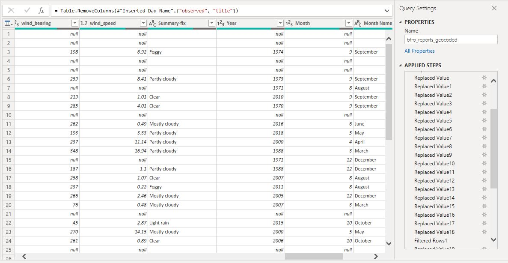
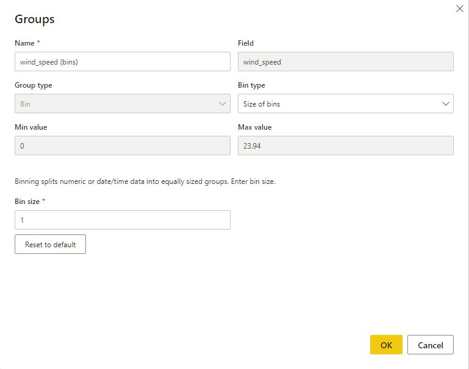
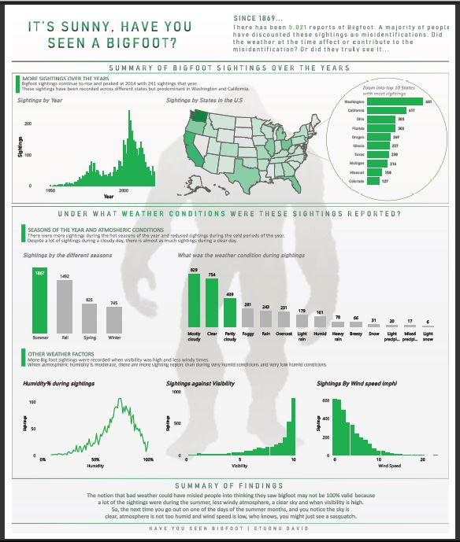

# Analysis of Bigfoot Sightings In The United States.

## Introduction
    This is a Microsoft Power BI analysis of the recorded sightings of Bigfoot in the united states
    from the 1960's to 2021 and the weather conditions in whhich these sightings were recorded.
    This data is from the monthly dataDNA challenge hosted by Pomerol Partners, Qlick, Packt Pub, DataCated and novypro.

## Skills Dmonstrated
    The following Power BI skills were demonstrated during this project:
    DAX, Power Query(for cleaning and Transformation), Binning and filters

## Problem Statement
 - Under what weather conditions were these sightings reported

## Data Sourcing
This is a single table and contains 25 columns which are as follows
- observed: What the observer was doinh when he saw Bigfoot
- county: What county in the United States was the sighting recorded
- state: What state was the sighting recorded
- season: What season of the year was the sighting recorded
- title : The report title
- latitude: Lattitude of the place
- longitude: Longitude of the place
- dateL:The date the sighting was recorded
- number:
- classification: classification of the sighting: Type A(The observer saw Bigfoot), Type B(The observer saw a sign of Bigfoot such as Bigfoot), Type C (The observer was told and did not see directly)
- temperature_high: Highest temperature of the day
- temperature_mid: Medium temperature of the day
- temperature_low: lowest temperature of the day
- dew_point:
- humidity:
- cloud_cover:
- moon_phase: The phase of the moon when the sighting was recorded
- precip_intensity
- precip_probability
- precip_type pressure
- summary : Summary of the weather under which the sighting was recorded
- uv_index: Ultaviolet light index when the sighting was recorded
- visibility: Visibility ranging from 1 to 10
- wind_bearing: direction of the wind when the sighting was recorded
- wind_speed: Wind speed when the sighting was recorded
There are 5,022 rows

The data is gotten from Kaggle.

## Data Transformation and cleaning
The columns cleaned and transformed were the ones beign used for the analysis.
The summary column was very important in the analysis and major cleaning was done in that aspect.
It was first duplicated and the duplicate column was called summary fix. Using the replace function in Power Query, important texts were extracted from the summaryfix column such as:
- **Foggy in the morning** was replaced with **Foggy**
- **Heavy rain in the morning** was replaced with **Heavy Rain**
- **Snowy in the morning** was replaced with **Snowy**
- **Partly cloudy in the morning** was replaced with **Partly cloudy**

- The Humidity column was originally in decimal format and was the converted to percentage format
- The Visibility column was a continuous variable and had alot of values after the decimal. These were grouped into bins with interval of 0.4
    the min value is 0.74 and the max value is 10

- The wind speed column was a continuous variable and had alot of values after the decimal. These were grouped into bins with interval of 1
 the min value is 0 and the max value is 23.94.

## Modelling.
This is a flat data and consist of just one table, so no data modelling was done.

## Analysis and Visualization.
Here is an image of the report created.

From the Report created the following insigts can be gotten:
- Bigfoot sightings have increased alot from when there was just one sighting in 1869 to about 241 sighting in 2014 which was the highets ever recorded.
- The majority of these sightings have been in Washington and California.
- Bigfoot sightings are more prevalent in the Summer months of the year and less in the cold winter months of the year.
- Though there are lots of sightings during bad weathers such as cloudy, partly cloudy whether, there is also alot of sightings during very clear weather which would contradict the believe that bad weather misled people into thinking they saw Big foot.
- Bigfoot sightings were recorded in just above average humidity, high visibility and low windspeeds.

## Conclusion and Recommendations.
Though there alot of non-believers of Bigfoots, and the assumption is that people who have Bigfoot are not sure of what they saw or were misled by bad weather,
this analysis seems to show that just as there lots of reports during bad weather, there are also lots of reports during a sunny, clear and bright sky. Which probably means that
bad weather didnt mislead some or all the people who reported that they saw Bigfoot.

More research can be carried out into how Big foot looks like and the reporters could be evaluated to see if they mistook a person, an ape or any other animal for Bigfoot.

**Thanks for reading**
